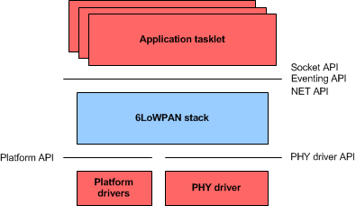

API Introduction
============

This chapter is an introduction to the 6LoWPAN stack, modules and API interfaces. It contains the following sections:

- [_About the 6LoWPAN stack_](#about-the-6lowpan-stack)
- [_Eventing system_](#eventing-system)
- [_Platform API_](#platform-api)
- [_Device drivers_](#device-drivers)

## About the 6LoWPAN stack

The 6LoWPAN stack is designed to be portable for various platforms and radio drivers. It uses a lightweight eventing system that allows to run on minimal design on the smallest microcontrollers even without operating systems. Application programming interfaces are designed to allow porting for new platforms. _Figure 1-1_ below shows high level API interfaces on the 6LoWPAN stack.

**Figure 1-1 High level API interfaces on 6LoWPAN stack**



The 6LoWPAN stack offers application designers interfaces for sending and receiving packets, configuring a network and running the event base system in the form of tasklets. For more information on the interfaces, 
see chapters [_An Event-driven Scheduling Model_](08_API_events.md), [_Network API Definitions_](09_API_network_def.md) and [_Sockets Use and Available APIs_](11_API_sockets.md).

The 6LoWPAN stack relies on two interfaces that must be ported to run it on a specific platform. Platform API defines an abstraction layer of the underlying microcontrollers or operating system. For more information 
on the Platform API, see section _Platform API_ in chapter [_Porting 6LoWPAN Stack_](16_API_porting.md).

PHY driver API is an abstraction between the driver and the 6LoWPAN stack and allows 6LoWPAN network to be formed on any 802.15.4 compatible or similar radio chip. The PHY driver API is not limited to only radio chips, 
even serial communication may be used. For more information on the PHY driver API, see section _Device driver API_ in chapter [_Porting 6LoWPAN Stack_](16_API_porting.md).

For more information on the 6LoWPAN stack architecture, and the protocol and application modules used by the 6LoWPAN stack, see [_ARM mbed 6LoWPAN Stack Overview_](01_overview.md).

## Eventing system

6LoWPAN stack eventing system is designed to be minimal and portable. Its main focus is on running in small embedded devices without any help of operating systems. Event based approach allows 6LoWPAN stack based applications to be designed for extremely low power use cases where thread based systems may consume too much battery time. The eventing system is designed to rely entirely on the Platform API so it is possible to port it to run on any operating system when the thread based approach is favored.

The eventing system specifies event handlers called tasklets that form the application logic. The 6LoWPAN stack allows the developer to define multiple tasklets to ease the task of writing complex applications. Each of these tasklets can then have full access to the network stack and its features through Socket, Eventing and NET APIs.

The following example shows the usage of a simple tasklet:

```
/* Main event handler */
void tasklet_main(arm_event_s *event)
{
	switch(event->event_type) {
	case ARM_LIB_TASKLET_INIT_EVENT:
		// Initialzation event is given when tasklet is created.
		// It will be called after a tasklet is registered to event OS.

		// Launch timer event to fire after a second
		timer_sys_event(MY_TX_TIMER, T_1000_MS);
		break;
	case ARM_LIB_SYSTEM_TIMER_EVENT:
		// Timer events are received in tasklet
		// Using a event type TIMER_EVENT
		// They receive 8bit identifier that
		// was passed to timer_sys_event().
		switch(event->event_id) {
		case MY_TX_TIMER:
			send_sensor_info();
			timer_sys_event(MY_TX_TIMER, T_1000_MS); //Relaunch
			break;
		}
		break;
	}
}

void main(void)
{
	int8_t tasklet_id;
	eventOS_scheduler_init();
	eventOS_event_handler_create(&tasklet_main, ARM_LIB_TASKLET_INIT_EVENT);
	eventOS_scheduler_run(); // Enter the event loop
}
```

In this code example, the main application registers an event handler called tasklet_main. This event handler is then used to send and receive timed events in one-second intervals. For a description of the functions used 
and their parameters, see chapter [_An Event-driven Scheduling Model_](08_API_events.md).

## Platform API

The Platform API is the base where the 6LoWPAN stack runs. It is the separation between the actual hardware or operating system and the 6LoWPAN stack itself. This is the first layer to study to port the 6LoWPAN stack to a new platform.

The most important parts of the Platform API are the timers and critical section functions. These are required for the event-based stack to start up and run.

_Table 1-1_ lists the scopes of the Platform API functions.

**Table 1-1 Scopes of Platform API functions**

<table>
   <tr>
      <td><b>Scope</b></td>
      <td><b>API responsibility</b></td>
   </tr>
<tr>
      <td>Critical section</td>
      <td>The 6LoWPAN stack uses the Platform API to signal that a device is about to enter or exit a critical section where interruptions are not tolerated.
<dl>
  	<dt>Functions:</dt>
  	<dd><code>platform_enter_critical()</code></dd>
  	<dd><code>platform_exit_critical()</code></dd>
</dl>
      </td>
   </tr>

<tr>
     <td>Idle and sleep functions</td>
     <td>The 6LoWPAN stack signals a possible idle or sleep condition. This part of the API is used to manage the power consumption of a processor core and radio drivers.
<dl>
  	<dt>Functions prefixed with:</dt>
  	<dd><code>eventOS_scheduler</code></dd>
</dl>
    </td></tr>


<tr>
     <td>Random number generation</td>
     <td>The 6LoWPAN stack relies on platform drivers to generate random numbers.
<dl>
  	<dt>Functions prefixed with:</dt>
  	<dd><code>platform_random</code></dd>

</dl>
    </td></tr>

<tr>
     <td>Timers</td>
     <td>The eventing system requires timers to be implemented on platform drivers.
<dl>
  	<dt>Functions prefixed with:</dt>
  	<dd><code>eventOS_event_timer</code></dd>
</dl>
    </td></tr>
<tr>
     <td>AES encryption</td>
     <td>To use security on a network layer, AES encryption must be implemented on platform drivers. This allows using hardware encryption where available. ARM supports sample software implementation for platforms without HW encryption.

  <code>platform_aes_block_encode()</code>
</td></tr>
</table>

## Device drivers

The 6LoWPAN stack uses radio drivers through a physical layer driver interface called PHY driver API. These functions allow the developers to easily port new drivers for the 6LoWPAN stack allowing 6LoWPAN to be implemented on a wide variety of networking devices.

The following code example shows a subset of imaginary drivers that send packets to a serial port:

```
/* Fill out the driver structure */
static phy_device_driver_s my_driver =
{
	.link_type = PHY_LINK_TUN,
	.tx = send,
	.state_control = state_control,
}

/* Driver implementation */
int8_t send(const uint8_t *data_ptr, uint16_t data_len, uint8_t tx_handle)
{
	// Send packet to serial line
	uart_send(data_ptr, data_len);
	return 0;
}

int8_t state_control(phy_interface_state_e new_state, uint8_t channel)
{
	switch(new_state) {
	case PHY_INTERFACE_UP:
		uart_enable();
		break;
	case PHY_INTERFACE_DOWN:
		uart_disable();
		break;
	}
	Return 0;
}

void uart_reader()
{
	static char *buffer[BUFFER_SIZE];
	uint16_t size;
	while(0 != (size=uart_read(buffer))) {
			// Incoming packets are pushed to Stack
			// using arm_net_phy_rx()
			arm_net_phy_rx(buffer, size, 0, interface_id);
	}
}

void register_my_driver()
{
	interface_id = arm_net_phy_register(&my_driver);
}
```

This driver sends raw IP packets to a serial interface. Incoming packets are pushed to the 6LoWPAN stack for parsing. Initialization of an actual hardware driver is left out from the example code.
