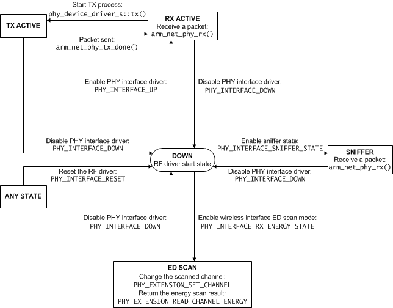
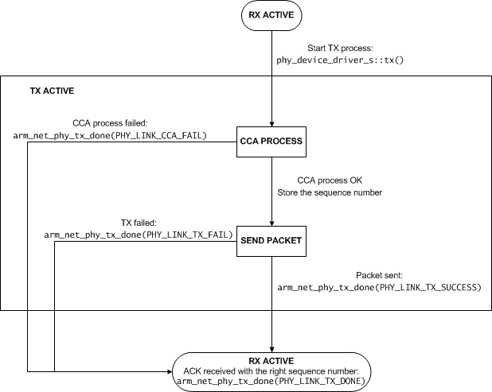

Porting 6LoWPAN Stack
=====================

This chapter describes porting the 6LoWPAN stack to a new platform. It contains the following sections:

- [_Porting 6LoWPAN stack to a new platform_](#porting-6lowpan-stack-to-a-new-platform)
- [_Platform API_](#platform-api)
- [_Device driver API_](#device-driver-api)

## Porting 6LoWPAN stack to a new platform

The 6LoWPAN stack has two sets of drivers that you must be aware of when porting it to a new platform. The drivers are divided into
platform drivers and device drivers.

The platform drivers are a set of functions that the underlying platform must provide to run an event loop in a specific environment.
These functions abstract away the underlying hardware and they can be ported to run on bare metal or from a full-featured operating
system. Because the 6LoWPAN stack is provided as part of mbed OS you already have platform drivers, therefore you do not need to port
these by yourself.

The device drivers are a set of functions for providing PHY layer devices for the 6LoWPAN stack. It consist of registering the device,
a receiving function and a set of device controlling functions. For more detailed information on the device drivers, see section
[_Device driver API_](#device-driver-api).


## Platform API

This section introduces the API for platform drivers. These functions must be implemented to run a 6LoWPAN stack in a given platform.
Here the platform may refer to a specific CPU or operating system.

### Required resources

The following resources are required for a platform driver API:

- A system timer and a MAC timer (a network timer):
	* Used as a source for SYSTEM TIMER TICK and MAC TIMER.
	* SYSTEM TIMER TICK multiplexed to CORE TIMER.
	* Resolution: 50us.
	* 16-bit or 32-bit resolution (platform specific).
	* Implementation guide: set the timer running and use the compare interrupt functionality of the timer.
- A sleep timer (optional, application specific):
	* Accuracy: 1ms.
	*32-bit resolution.
- AES:
	* Implementation is optional.
	* SW or HW accelerated AES.
	* This function performs Si=E[key,Ai] (a simple ECB block).
- A pseudorandom number generator:
	* 8-bit, 16-bit, 32-bit and n-bit (using length and pointer).
	* Statistically valid.
- An RF interface:
	* PHY data flow API.
	* Extension to set Channel, Link ON/OFF, Reset, ED_SCAN, ShortAddress, PAN ID, PendingBit.
	* Calculate LQI from RSSI.
	* Energy detection.
- An Ethernet interface (optional):
	* PHY data flow API.
	* Extension for BAUDRATE Read.
	* Link ON/OFF detection (cable ON and OFF detection).
- `platform_enter_critical` and `platform_exit_critical`:
	* Recursive, general interrupt control.
- CPU power mode control (optional, application specific).
- Idle, sleep timer, external wakeup modes.


### 6LoWPAN stack event OS port

_Table 11-1_ describes the functions that the 6LoWPAN stack event base system requires for porting.

**Table 11-1 Functions required for porting**

Function|Desciption
--------|----------
`eventOS_scheduler_wait()`|Stack enters idle state and starts waiting for a signal
`eventOS_scheduler_signal()`|Stack wakes from idle
`eventOS_scheduler_sleep()`|CPU deep sleep for a given time
`platform_enter_critical()`|Disables global interrupts
`platform_exit_critical()`|Enables global interrupts

For more information on the functions, see [_Process API_](#process-api).

### 6LoWPAN stack peripherals API port

The 6LoWPAN stack requires the following peripherals for porting:

- 1 timer.
- Random number seed for a pseudorandom generator.
- AES Encode block for Si=E[key,Ai].

The 6LoWPAN stack only needs one timer that must give a 50us resolution for an ordered timer counter. For more information on the timer, see section [_NET timer API definition_](#net-timer-api-definition).


### NET timer API definition

The Timer Platform API is used for platform porting. _Table 11-2_ introduces the timer functions the 6LoWPAN stack is using.

**Table 11-2 Timer functions**

Function|Description
--------|-----------
`platform_timer_enable()`|Initializes the timer
`platform_timer_set_cb()`|API for setting the timer interrupt handler for a stack
`platform_timer_start()`|Starts the timer for a given period
`platform_timer_disable()`|Stops the timer

#### Initialize platform timer peripheral

To initialize the peripheral driver of the 6LoWPAN stack timer, use the following function call:

```
void platform_timer_enable
(
	void
)
```

#### Disable platform timer

To stop the system timer source of the driver, use the following function call:

```
void platform_timer_disable
(
	void
)
```

#### Set compare timer

To set the compare timer event for stack, use the following function call:

```
void platform_system_timer_start
(
	uint16_t slots
)
```

where:

<dl>
<dt><code>slots</code></dt>
<dd>Defines the number of 50us time slots the timer event stack wants.</dd>
</dl>

#### Callback function set

To set the timer interrupt handler for stack, use the following callback function call:

```
void platform_system_timer_set_cb
(
	void
	(*new_fp)(void)
)
```

where:

<dl>
<dt><code>new_fp</code></dt>
<dd>A function pointer for stack giving timer handler.</dd>
</dl>


### AES 128-bit block encode API

To perform a 128-bit `Si=E[key,Ai]` block encoding for given Ai data using the supplied key, use the following function call:

```
void platform_aes128_block_encode
(
	uint8_t * key_ptr ,
	uint8_t * Ai_ptr,
	uint8_t * Si_ptr
)
```

where:

<dl>
<dt><code>key_ptr</code></dt>
<dd>A pointer to a 128-bit key.</dd>

<dt><code>Ai_ptr</code></dt>
<dd>A pointer to a 128-bit data block that is to be decoded.</dd>

<dt><code>Si_ptr</code></dt>
<dd>A pointer to a 128-bit data block where the encoded result is stored in.</dd>

<dt><code>Return value</code></dt>
<dd>None.</dd>
</dl>

### Random number API

To return a 32-bit seed for a pseudorandom generator, use the following function call:

```
uint32_t platform_random_seed_get
(
	void
)
```

where:

<dl>
<dt><code>Return value</code></dt>
<dd>A 32-bit random initialization seed value.</dd>
</dl>

The pseudorandom generator requests this seed on initialization.

### Global interrupt control API

The platform driver code must provide protection for a stack when there are critical code sections. Some stack interfaces might be called within interrupts or from multiple threads, so protection is required. On some platform,
these disable interrupts. On some platform, it is only a recursive mutex.

When a stack is about to enter a critical section, it uses the following function call:

```
void platform_enter_critical
(
	void
)
```

When a stack exits a critical section, it uses the following function call:

```
void platform_exit_critical
(
	void
)
```

### Process API

These functions provide a portable layer for handling idle states for a stack.

This function is called when the stack enters idle state and starts waiting for a signal. The 6LoWPAN stack calls this function whenever the event queue is empty. The function disables the current task or the CPU as follows:

1. Use pure 6LoWPAN stack 1 thread system:
	* Sets the global parameter to wait for a signal state and sets the CPU to idle.
2. RTOS or any multithread:
	* Stops the running thread and waits for a signal.

```
void eventOS_scheduler_wait
(
	void
)
```

The 6LoWPAN stack calls this function when it receives an external event and wakes from idle. The function wakes the sleeping thread currently used by the OS.

```
void eventOS_scheduler_signal
(
	void
)
```

This function is called when the stack enters deep sleep state for a period of time. This function enables thread sleep or the CPU deep sleep for a given time. It may also set specific peripherals to sleep mode, if they
are not required.

```
uint32_t eventOS_scheduler_sleep
(
	uint32_t sleep_time_ms
)
```

where:

<dl>
<dt><code>sleep_time_ms</code></dt>
<dd>Sleep time in milliseconds.</dd>

<dt><code>Return value</code></dt>
<dd>Time slept in milliseconds.</dd>
</dl>

## Device driver API

The 6LoWPAN stack uses the Device driver API to communicate with different physical layer drivers. The 6LoWPAN stack supports different device types for PHY layer and special cases where raw IPv6 datagrams
are forwarded to a driver.

The driver must first be registered with the 6LoWPAN stack using the `phy_device_driver_s` structure defined in section [_PHY device driver register_](#phy-device-driver-register). This structure defines
all the functions that a stack uses in calling a device driver. When the device driver must call the driver API from the stack, it uses the ID number received in the registration phase to distinct between
different devices. The following sections define the contents of the driver structures and API interfaces that the driver can use.

### How to create a new RF driver

The following steps describe how you can create a new RF driver.

1. Read through the section [_Example RF driver_](#example-rf-driver). You can use this example code as your starting point

2. Fill in the actual transceiver specific parts of the RF driver.

3. Register the driver to 6LoWPAN stack on your application. You can use the example node applications with your driver.

4. Configure the interface. See instructions in section _How to configure a network interface_ of the chapter [_6LoWPAN Stack Initialisation_](07_API_initialize.md).

5. Check with a RF sniffer tool that you can see RF packets transmitted when you start your device. The 6LoWPAN bootstrap should start with IEEE 802.15.4 Beacon Request packets.

### RF driver states

_Figure 11-1_ below shows the basic states of the RF driver.

The following describes the basic states in more detail:

<dl>
<dt><b>DOWN</b></dt>
<dd>This is the initial state of the driver. The radio is not used in this state.</dd>

<dt><b>RX ACTIVE</b></dt>
<dd>In this state, the driver has the radio turned on and it can receive a packet or ACK from the radio. The driver can also go from this state to the TX ACTIVE state to transmit a packet.</dd>

<dt><b>TX ACTIVE</b></dt>
<dd>In this state, the driver will try to start a transmission:</dd>
<dd>
<ol>
<li>It must first check that it is not currently busy doing something else.</li>
<li>It must check that the channel is free.</li>
<li>Finally, it can try to transmit the packet.</li>
</ol>
</dd>
<dt><b>SNIFFER</b></dt>
<dd>This mode can be implemented to enable using the device as a packet sniffer. In this state, the RX is always on and the received packets are sent to the application layer but nothing is transmitted back.</dd>

<dt><b>ED SCAN</b></dt>
<dd>This mode can be implemented to enable using energy scan. It enables scanning the energy from channels one by one and nothing else.</dd>

<dt><b>ANY STATE</b></dt>
<dd>This state represents all the states in the state machine.</dd>
</dl>

**Note**

The driver initialization and registration using the function `arm_net_phy_register` are not covered here and must be performed before the driver is functional.

For more details on the TX process, see _Figure 11-2_.

**Figure 11-1 RF driver states**



In sniffer mode, the device only receives packets, never ACKs or sends them.

The following commands are received as a parameter of the function `state_control` defined in the struct of type `phy_device_driver_s`:

- `PHY_INTERFACE_UP`
- `PHY_INTERFACE_DOWN`
- `PHY_INTERFACE_RESET`
- `PHY_INTERFACE_RX_ENERGY_STATE`
- `PHY_INTERFACE_SNIFFER_STATE`

The following commands are received as a parameter of the function `extension` defined in the struct of type `phy_device_driver_s`:

- `PHY_EXTENSION_READ_CHANNEL_ENERGY`
- `PHY_EXTENSION_SET_CHANNEL`

_Figure 11-2_ describes the TX process.

The following describes the states in more detail:

<dl>
<dt><b>CCA PROCESS</b></dt>
<dd>In the <i>Clear Channel Assessment</i> (CCA) process, the radio checks that the channel is free before it starts sending anything to avoid collisions.<br>
Before starting the actual CCA process, the driver checks that it is not currently receiving a packet from the radio, in which case the CCA process fails.</dd>

<dt><b>SEND PACKET</b></dt>
<dd>In this state, the driver commands the radio to send the data given to the driver as a parameter from the function tx defined in the struct of type <code>phy_device_driver_s</code>.</dd>
</dl>

**Figure 11-2 TX process**



### PHY device driver register

This function is for the dynamic registration of a PHY device driver. The 6LoWPAN stack allocates its own device driver list internally. This list is used when an application creates network interfaces to a specific PHY driver.
To register a PHY driver to the stack, use the following function call:

```
int8_t arm_net_phy_register
(
	phy_device_driver_s *phy_driver
)
```

where:

<dl>
<dt><code>phy_driver</dt></code>
<dd>A pointer to a driver structure.</dd>
<dt><code>Return value</dt></code>
<dd>>=0 The registration is OK and the return value indicates a unique ID for the device driver. The ID is required for pairing a network stack interface with the correct driver instance.</dd>
<dd>-1 A structure parameter failure or a NULL pointer.</dd>
</dl>


### PHY data RX API

This is a standard data RX interface for the 6LoWPAN stack.

The driver API platform calls this function to push the received data from a PHY to the stack:

```
int8_t arm_net_phy_rx
(
	data_protocol_e data_type,
	const uint8_t *data_ptr,
	uint16_t data_len,
	uint8_t link_quality,
	int8_t dbm,
	int8_t interface_id
)
```

where:

<dl>
<dt><code>data_type</dt></code>
<dd>Defines the received data packet content. The value can be one of the following:</dd>
<dd><code>NANOSTACK_LOCAL_SOCKET_DATA</code> Local socket data between tunnel drivers.</dd>
<dd><code>NANOSTACK_INTERFACE_DATA</code> Interface configuration data.</dd>
<dd><code>PHY_LAYER_PAYLOAD</code> PHY layer packet, for example Ethernet.</dd>
<dd><code>IPV6_DATAGRAM</code> Packet is IPv6 frame.</dd>

<dt><code>data_ptr</dt></code>
<dd>A pointer to data.</dd>

<dt><code>data_len</dt></code>
<dd>Data length.</dd>

<dt><code>link_quality</dt></code>
<dd>A link quality value. A value of <code>0x00</code> indicates the worst possible and <code>0xFF</code> the best possible link quality. If the device driver cannot determine the link quality, the value must be
set to <code>0x80</code>.</dd>

<dt><code>dbm</dt></code>
<dd>A received signal strength indication, in the range of -128 to +127, expressed as dBm. If the device driver cannot determine the signal strength, the value must be
set to <code>0</code>.</dd>

<dt><code>interface_id</dt></code>
<dd>The interface ID where the packet is coming from.</dd>

<dt><code>Return value</dt></code>
<dd>>=0 Data allocation is OK and the Packet push to the stack was successful.</dd>
<dd>-1 A memory allocation failure or a stack RX queue overflow.</dd>
</dl>

### PHY data TX done API

This is a callback to notify the result of TX phase from the PHY driver.

The driver API platform calls this function when it has completed a transmit attempt:

```
int8_t arm_net_phy_tx_done
(
	uint8_t interface_id,
	uint8_t tx_handle,
	link_tx_status_t status,
	uint8_t cca_retry,
	uint8_t tx_retry
)
```

where:

<dl>
<dt><code>interface_id</dt></code>
<dd>An interface ID for the TX done event.</dd>

<dt><code>tx_handle</dt></code>
<dd>A handle to indicate the packet this event is related to.</dd>

<dt><code>status</dt></code>
<dd><code>PHY_LINK_TX_DONE</code>Packet transmitted and ACK received succesfully.</dd>
<dd><code>PHY_LINK_TX_DONE_PENDING</code> Transmitted succesfully and ACKed. The received ACK contains indirect data pending flag set.</dd>
<dd><code>PHY_LINK_TX_SUCCESS</code> Packet transmitted. Might be pending for ACK packet (on unicast packets).</dd>
<dd><code>PHY_LINK_TX_FAIL</code> Failed to receive ACK from destination.</dd>
<dd><code>PHY_LINK_CCA_FAIL</code> CCA process failed, channel busy.</dd>

<dt><code>cca_retry</dt></code>
<dd>Defines the number of CCA attempts made. Used for CSMA-CA.</dd>

<dt><code>tx_retry</dt></code>
<dd>Number of TX attempts made. Used for auto-retry mode.</dd>

<dt><code>Return value</dt></code>
<dd>>=0 OK.</dd>
<dd>-1 An unknown interface ID or handle.</dd>
</dl>

When the PHY device handles the CSMA-CA and auto-retry, the stack needs to know the total number of CCA attempts or TX attempts made in case of error.
The stack retries the CCA phase 8 times and the TX attempt 4 times. These may be handled by the hardware.

If the CSMA-CA is handled by the hardware, the `cca_retry` should return a value larger than 7 if returning `PHY_LINK_CCA_FAIL` status to the stack.
If the total number of CCA retries is less than 8, the stack initiates a new CCA phase.

When hardware handles the auto-retry mode, the error cases should report the number of TX attempts made in the `tx_retry` parameter. IF the total number of retries is less that 4, the stack initiates a retransmission.

### PHY driver structure and enumeration definitions

This section introduces driver API specific structures and enumerations.

#### PHY TX process status code

This enumeration defines the PHY TX process status code:

```
typedef enum phy_link_tx_status_e
{
	PHY_LINK_TX_DONE,
	PHY_LINK_TX_DONE_PENDING,
	PHY_LINK_TX_SUCCESS,
	PHY_LINK_TX_FAIL,
	PHY_LINK_CCA_FAIL
} phy_link_tx_status_e;
```

where:

<dl>
<dt><code>TX_DONE</dt></code>
<dd>the TX process is Ready and ACK RX.</dd>

<dt><code>TX_DONE_PENDING</dt></code>
<dd>the TX process is OK with an ACK pending flag.</dd>

<dt><code>TX_SUCCESS</dt></code>
<dd>the MAC TX complete MAC will make a decision to enter a wait ack or TX Done state.</dd>

<dt><code>TX_FAIL</dt></code>
<dd>the link TX process fails.</dd>

<dt><code>CCA_FAIL</dt></code>
<dd>the RF link CCA process fails.</dd>
</dl>

#### PHY address types

This enumeration defines the PHY address types:

```
typedef enum phy_address_type_e
{
	PHY_MAC_48BIT,
	PHY_MAC_64BIT,
	PHY_MAC_16BIT,
	PHY_MAC_PANID
} phy_address_type_e;
```

where:

<dl>
<dt><code>MAC_48BIT</dt></code>
<dd>is an IPv4 or IPv6 link layer address for Ethernet. This is optional information.</dd>

<dt><code>MAC_64BIT</dt></code>
<dd>is an RF or a generic link layer address.</dd>

<dt><code>MAC_16BIT</dt></code>
<dd>is an RF interface short address.</dd>

<dt><code>MAC_PANID</dt></code>
<dd>is an RF interface 16-bit PAN ID.</dd>
</dl>

#### PHY interface control types

This enumeration defines the PHY interface control types:

```
typedef enum phy_interface_state_e
{
	PHY_INTERFACE_RESET,
	PHY_INTERFACE_DOWN,
	PHY_INTERFACE_UP
} phy_interface_state_e;
```

where:

<dl>
<dt><code>RESET</dt></code>
<dd>resets a PHY driver and sets it to idle.</dd>

<dt><code>DOWN</dt></code>
<dd>disables the PHY interface driver (RF radio disabled).</dd>

<dt><code>UP</dt></code>
<dd>enables the PHY interface driver (RF radio receiver ON).</dd>
</dl>

#### PHY extension types

This enumeration defines the PHY extension types:

```
typedef enum phy_extension_type_e
{
	PHY_EXTENSION_CTRL_PENDING_BIT,
	PHY_EXTENSION_SET_CHANNEL,
	PHY_EXTENSION_READ_CHANNEL_ENERGY,
	PHY_EXTENSION_READ_LINK_STATUS
} phy_extension_type_e;
```

where:

<dl>
<dt><code>CTRL_PENDING_BIT</dt></code>
<dd>controls the MAC pending bit for indirect data.</dd>

<dt><code>SET_CHANNEL</dt></code>
<dd>sets the RF channel.</dd>

<dt><code>READ_CHANNEL_ENERGY</dt></code>
<dd>reads the ED scan energy of the RF interface.</dd>

<dt><code>READ_LINK_STATUS</dt></code>
<dd>reads the link status.</dd>
</dl>

#### PHY device driver

This PHY device driver structure comprises the following variables:

```
typedef struct phy_device_driver_s
{
	phy_link_type_e link_type;
	driver_data_request_e data_request_layer;
	uint8_t *PHY_MAC;
	char * driver_description;
	uint16_t phy_MTU;
	uint8_t phy_tail_length;
	uint8_t phy_header_length;
	int8_t (*state_control)(phy_interface_state_e, uint8_t);
	int8_t (*tx)(uint8_t *,uint16_t,uint8_t, data_protocol_e);
	int8_t (*address_write)(phy_address_type_e ,uint8_t *);
	int8_t (*extension)(phy_extension_type_e,uint8_t *);
	phy_device_channel_info_s *link_channel_info;
} phy_device_driver_s;
```

where:

<dl>
<dt><code>link_type</dt></code>
<dd>defines the device driver type.</dd>

<dt><code>data_request_layer</dt></code>
<dd>defines the interface Data OUT protocol.</dd>

<dt><code>PHY_MAC</dt></code>
<dd>is a pointer to a 48-bit or 64-bit MAC address.</dd>

<dt><code>driver_description</dt></code>
<dd>is a short driver-specific description in Null-terminated string format.</dd>

<dt><code>phy_MTU</dt></code>
<dd>defines the maximum MTU size of the physical layer.</dd>

<dt><code>phy_tail_length</dt></code>
<dd>defines the tail length used by the PHY driver.</dd>

<dt><code>phy_header_length</dt></code>
<dd>defines the header length used by the PDU PHY driver.</dd>

<dt><code>state_control</dt></code>
<dd>is a function pointer to the interface state control.</dd>

<dt><code>tx</dt></code>
<dd>is a function pointer to the interface TX functionality.</dd>

<dt><code>address_write</dt></code>
<dd>is a function pointer to the interface address writing (PAN ID, short address).</dd>

<dt><code>extension</dt></code>
<dd>is a function pointer to the interface extension control.</dd>

<dt><code>link_channel_info</dt></code>
<dd>this pointer must be set only when the interface type is:</dd>
<dd><code>NET_INTERFACE_WIFI</code></dd>
<dd><code>NET_INTERFACE_RF_6LOWPAN</code></dd>
<dd><code>NET_INTERFACE_RF_ZIGBEEIP</code></dd>
<dd><code>NET_INTERFACE_PLC_6LOWPAN</code></dd>
</dl>

#### PHY device channel information

This structure defines the PHY device channel information and comprises the following variables:

```
typedef struct phy_device_channel_info_s
{
	phy_link_type_e link_type;
	uint8_t channel_count;
	uint32_t channel_mask
} phy_device_channel_info_s;
```

where:

<dl>
<dt><code>link_type</dt></code>
<dd>defines the link type.</dd>

<dt><code>channel_count</dt></code>
<dd>defines the supported channel count for an FHSS link.</dd>

<dt><code>channel_mask</dt></code>
<dd>defines channels for 802.15.4 radio. Channels from 0 to 10 are for sub-GHz radio and from 11 to 26 for 2.4GHz radio.</dd>
</dl>

#### PHY device link type

This enumeration defines the PHY device link types:

```
typedef enum phy_link_type_e
{
	PHY_LINK_ETHERNET_TYPE,
	PHY_LINK_15_4_2_4GHZ_TYPE,
	PHY_LINK_15_4_SUBGHZ_TYPE,
	PHY_LINK_TUN
} phy_link_type_e;
```

where:

<dl>
<dt><code>ETHERNET_TYPE</dt></code>
<dd>is a standard IEEE 802 Ethernet type.</dd>

<dt><code>15_4_2_4GHZ_TYPE</dt></code>
<dd>is a standard 802.15.4 2.4GHz radio.</dd>

<dt><code>15_4_SUBGHZ_TYPE</dt></code>
<dd>is a standard 802.15.4 sub-1GHz radio 868/915MHz.</dd>

<dt><code>TUN</dt></code>
<dd>is a Linux virtual TUN interface or similar.</dd>
</dl>

### Example RF driver

The following code example is not a complete driver but shows you how to use the API to create a RF driver.

```
static uint8_t mac_address[8];
static phy_device_channel_info_s channel_info;
static phy_device_driver_s device_driver;
static int8_t rf_radio_driver_id = -1;

int8_t rf_device_register(void)
{
    /* Do some initialization */
    rf_init();

    /* Set pointer to MAC address */
    device_driver.PHY_MAC = mac_address;
    /* Set driver Name */
    device_driver.driver_description = "Example";

    if(subghz_radio) /* Configuration for Sub GHz Radio */
    {
        /*Number of channels in PHY*/
        channel_info.channel_count = 11;
        /*Channel mask 0-10*/
        channel_info.channel_mask = 0x000007ff;
        /*Type of RF PHY is SubGHz*/
        device_driver.link_type = PHY_LINK_15_4_SUBGHZ_TYPE;
    }
    else /* Configuration for 2.4 GHz Radio */
    {
        /*Number of channels in PHY*/
        channel_info.channel_count = 16;
        /*Channel mask 26-11*/
        channel_info.channel_mask = 0x07FFF800;
        /*Type of RF PHY is 2.4 GHz*/
        device_driver.link_type = PHY_LINK_15_4_2_4GHZ_TYPE;
    }
    device_driver.link_channel_info = &channel_info;

    /*Maximum size of payload is 127*/
    device_driver.phy_MTU = 127;
    /*No header in PHY*/
    device_driver.phy_header_length = 0;
    /*No tail in PHY*/
    device_driver.phy_tail_length = 0;

    /*Set up driver functions*/
    device_driver.address_write = &rf_address_write;
    device_driver.extension = &rf_extension;
    device_driver.state_control = &rf_interface_state_control;
    device_driver.tx = &rf_start_cca;

    /*Register device driver*/
    rf_radio_driver_id = arm_net_phy_register(&device_driver);

    return rf_radio_driver_id;
}

void rf_handle_rx_end(void)
{
    uint8_t rf_lqi;
    int8_t rf_rssi;
    uint16_t rf_buffer_len;
    uint8_t *rf_buffer;

    /* Get received data */
    rf_buffer_len = rf_get_rf_buffer(rf_buffer);
    if(!rf_buffer_len)
        return;

    /* If waiting for ACK, check here if the packet is an ACK to a message previously sent */

    /* Get link information */
    rf_rssi = rf_get_rssi();
    rf_lqi = rf_get_lqi();

    /* Note: Checksum of the packet must be checked and removed before entering here */

    /* Send received data and link information to the network stack */
    arm_net_phy_rx(PHY_LAYER_PAYLOAD, rf_buffer, rf_buffer_len, rf_lqi, rf_rssi, rf_radio_driver_id);
}

int8_t rf_start_cca(uint8_t *data_ptr, uint16_t data_length, uint8_t tx_handle, data_protocol_e data_protocol)
{
    /*Check if transmitter is busy*/
    if(transmitter_busy)
    {
        /*Return busy*/
        return -1;
    }
    else
    {
        /*Check if transmitted data needs to be ACKed*/
        if(*data_ptr & 0x20)
            need_ack = 1;
        else
            need_ack = 0;
        /*Store the sequence number for ACK handling*/
        tx_sequence = *(data_ptr + 2);

        /* Store date and start CCA process here */
        /* When the CCA process is ready send the packet */
        /* Note: Before sending the packet you need to calculate and add a checksum to it, unless done automatically by the radio */
    }

    /*Return success*/
    return 0;
}

static int8_t rf_interface_state_control(phy_interface_state_e new_state, uint8_t rf_channel)
{
    int8_t ret_val = 0;
    switch (new_state)
    {
        /*Reset PHY driver and set to idle*/
        case PHY_INTERFACE_RESET:
            rf_reset();
            break;
        /*Disable PHY Interface driver*/
        case PHY_INTERFACE_DOWN:
            rf_shutdown();
            break;
        /*Enable PHY Interface driver*/
        case PHY_INTERFACE_UP:
            rf_channel_set(rf_channel);
            rf_receive();
            break;
        /*Enable wireless interface ED scan mode*/
        case PHY_INTERFACE_RX_ENERGY_STATE:
            break;
        /*Enable Sniffer state*/
        case PHY_INTERFACE_SNIFFER_STATE:
            rf_setup_sniffer(rf_channel);
            break;
    }
    return ret_val;
}

static int8_t rf_extension(phy_extension_type_e extension_type, uint8_t *data_ptr)
{
    switch (extension_type)
    {
        /*Control MAC pending bit for Indirect data transmission*/
        case PHY_EXTENSION_CTRL_PENDING_BIT:
        /*Return frame pending status*/
        case PHY_EXTENSION_READ_LAST_ACK_PENDING_STATUS:
            *data_ptr = rf_if_last_acked_pending();
            break;
        /*Set channel, used for setting channel for energy scan*/
        case PHY_EXTENSION_SET_CHANNEL:
            break;
        /*Read energy on the channel*/
        case PHY_EXTENSION_READ_CHANNEL_ENERGY:
            *data_ptr = rf_get_channel_energy();
            break;
        /*Read status of the link*/
        case PHY_EXTENSION_READ_LINK_STATUS:
            *data_ptr = rf_get_link_status();
            break;
    }
    return 0;
}

static int8_t rf_address_write(phy_address_type_e address_type, uint8_t *address_ptr)
{

    switch (address_type)
    {
        /*Set 48-bit address*/
        case PHY_MAC_48BIT:
            /* Not used in this example */
            break;
        /*Set 64-bit address*/
        case PHY_MAC_64BIT:
            rf_set_mac_address(address_ptr);
            break;
        /*Set 16-bit address*/
        case PHY_MAC_16BIT:
            rf_set_short_adr(address_ptr);
            break;
        /*Set PAN Id*/
        case PHY_MAC_PANID:
            rf_set_pan_id(address_ptr);
            break;
    }

    return 0;
}
```


